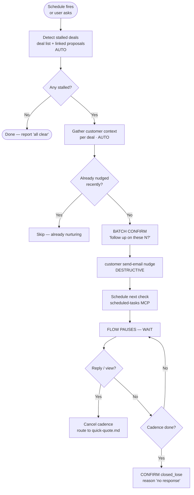

# Stalled Deal Recovery — Flow 3 (autonomous re-engagement)

Re-engage deals that have gone quiet. A proposal went out, the customer never
replied, and the deal is now decaying in the `proposal` stage. This flow detects
those, nudges the customer (with the user's batch approval), keeps a polite
cadence going via scheduled checks, and either revives the deal or closes it
out honestly when the trail goes cold.

This is the one flow with **no required user trigger** — it's designed to run
from a scheduled check (daily / weekly) or to be called as the tail of
`quick-quote.md` / `win-deal.md` when a sent proposal has gone unanswered.

> ## ⚠️ Adapted to the real CLI — read this before you start
>
> The root design doc (`agent-flows.md`) draws this flow around a **Sequences**
> engine (`sequence enroll` / `sequence pause`) and a `meeting create --suggest-slots`
> command. **Neither exists in the CLI.** There is no `sequence` verb, no
> sequence backend, and `meeting` only supports `list` (no `create`). Do not try
> to call them — they will fail.
>
> This flow implements the *same outcome* with the primitives that DO exist:
>
> | Design-doc step | What you actually run |
> |---|---|
> | `deal.list --key proposal` | `bookipi deal list --status proposal --json` (flag is `--status`, not `--key`) |
> | `deal.list --not-key closed_win,closed_lose` | Omit `--status` to list all stages, then drop `closed_win` / `closed_lose` client-side (there is no `--not-key`) |
> | `sequence.enroll nurture-sequence` | A `customer send-email` nudge **+** a `scheduled-tasks` MCP cron that fires the next nudge — the cadence lives in the scheduler, not a server-side sequence |
> | `sequence.pause` | Cancel / disable the scheduled task via the `scheduled-tasks` MCP |
> | `sequence.status === completed` | Your cadence counter hit its last step with no reply |
> | `meeting.create --suggest-slots` | Doesn't exist — instead send a slot-proposing email, or hand back to `quick-quote.md` once the customer re-engages |
>
> Everything below uses only real commands. When you cite a step to the user,
> describe the *outcome* ("I'll send Maria a gentle follow-up and check back in
> 3 days"), never the missing machinery.

> ## ⚠️ Confirmation rules — read before any send
>
> 1. **`customer send-email` (the nudge)** — sends a real email. **Destructive.**
>    When recovering several deals at once, **batch the confirmation**: present
>    *"I'll send follow-ups to these 7 stalled deals — proceed?"* with the list,
>    and get one approval for the batch. Never fire 7 separate confirmations, and
>    never send a nudge with no confirmation at all.
> 2. **`deal update --key closed_lose`** — moves the deal to a terminal stage.
>    **Destructive.** Confirm per deal (or batch with an explicit list) before
>    closing anything out as lost.
>
> Read-only steps (`deal list`, `customer list`, `proposal list`, reading a
> deal's linked artifacts) run silently — no confirmation.

## When to Trigger This Flow

**Autonomous / scheduled (the primary path):**

- A `scheduled-tasks` cron fires with a prompt like *"check for stalled deals and run recovery."*
- The tail of `quick-quote.md` step 9 / `win-deal.md`: a proposal-monitor task fired, found the proposal still `sent` (not viewed/accepted/declined) past its window → route here.

**User-triggered:**

- *"Chase my stalled deals"* / *"Follow up on proposals that went quiet"*
- *"Anything stuck in the pipeline?"* → run **detection only** (Phase 1) and report; ask before nudging.
- *"Re-engage Acme"* (single named deal) → skip detection, jump to Phase 2 for that one deal.

**Do NOT trigger this flow when:**

- The user just wants a read-only pipeline view → that's `morning-brief.md` (it *surfaces* stalled proposals passively; this flow *acts* on them).
- The proposal was sent **recently** (under the stall threshold, default 7 days) — it's not stalled, leave it alone.
- The customer already **replied** / **viewed and is mid-negotiation** — that's not a stall, route back to `quick-quote.md`.

> **Relationship to the morning brief:** `morning-brief.md` *reports* stalled
> proposals (5+ days) as a passive highlight. This flow is the *action* arm — it
> actually sends the nudge and schedules the cadence. The brief should never
> auto-send anything; if the user reads the brief and says "chase those", that's
> the handoff into this flow.

## The Flow

Four phases. Phase 1 (detect) and Phase 2 (nudge) happen in one session. Phase 3
(cadence) hands off to the scheduler. Phase 4 (resolve) runs later, when a
scheduled check fires or the user reports a reply — it does **not** belong in the
same turn as Phase 2.



### Phase 1 — Detect stalled deals (AUTO, read-only)

A deal is **stalled** when it sits in the `proposal` stage with a linked proposal
that's still `sent` (never advanced to `read` / `accepted` / `declined`) and that
proposal went out **N+ days ago** (default `N = 7`). There's no `lastActivityAt`
on the deal — you infer staleness from the proposal's own date.

> **Why this filter is reliable:** `deal list` returns each deal's linked
> `proposals[]` inline (with `status`, `createdAt`, `title`). And `proposal list`
> exposes `status`, `viewedDate`, `expirationDate`, `updatedAt`, `createdAt`. So
> you can detect a stall entirely client-side from data the API already returns —
> no new endpoint needed.

```bash
# 1. Pull every deal currently in the proposal stage (single fast call).
bookipi deal list --status proposal --json          [AUTO]

# 2. (Optional, for richer status/age) cross-reference proposals directly.
#    proposal list exposes viewedDate + the timestamps you need to age them.
bookipi proposal list --status sent --json           [AUTO]
```

> **Performance:** filter with `--status proposal` — don't run a bare
> `deal list`. Without a status filter the CLI fans out one API call per stage
> (~7 calls, ~2.7s). `--status proposal` is a single ~0.8s call. (See the
> `--status` rationale in `quick-quote.md` step 1+2.)

**Decide "stalled" per deal, client-side:**

For each deal returned at `status === "proposal"`, look at its linked proposal:

| Linked proposal state | Stalled? |
|---|---|
| `status === "sent"`, age ≥ N days, no `viewedDate` | **Yes** — cold (never opened) |
| `status === "sent"`, age ≥ N days, has `viewedDate` but no reply | **Yes** — warm (opened, ghosted) |
| `status === "sent"`, age < N days | No — too fresh, leave it |
| `status === "read"` / `accepted` / `declined` | No — not a stall; it moved |

Use the proposal's `createdAt` (or `updatedAt` at send time) for the age math —
the schema has no dedicated `sentAt`. **Warm vs. cold matters for the nudge tone**
(see Phase 2): a customer who *opened* the proposal but went quiet gets a
different message than one who never opened it.

> **Custom stages:** if the user added a non-standard stage key (e.g.
> `legal_review`) the deal may not be at `proposal` even though a proposal is
> out. Don't drive recovery off custom keys — treat them as generic `open` and
> leave them to the user. See `agent-flows.md` § Stage Keys & Customization.

**If nothing is stalled:** report one honest line (*"Pipeline's clean — nothing's
been sitting unanswered past a week."*) and stop. Don't pad.

**If the trigger was user-asked "what's stuck?":** present the stalled list and
**stop here** — ask via `AskUserQuestion` whether to start follow-ups before
touching Phase 2. Only an autonomous/scheduled run proceeds straight into Phase 2.

### Phase 2 — Nudge (one batch-confirmed send per stalled deal)

**2a. Gather context per stalled deal (AUTO, parallel).** You need the customer's
email and name to send and personalize. The `deal list` response already nests
`customer { firstName lastName email ... }` and `proposals { title ... }` — reuse
that; **don't** re-query what you already have. Only fetch more if the email is
missing:

```bash
bookipi customer list --search "<name-or-email>" --json   [AUTO, only if needed]
```

**2b. Idempotency check — don't re-nudge a deal that's already being nurtured.**
There's no sequence record to read, so the cadence's *memory* lives in the
`scheduled-tasks` MCP. Before nudging:

```
mcp__scheduled-tasks__list_scheduled_tasks
```

Look for a task whose title/prompt contains this deal's `_id` or the customer's
email (use the immutable deal `_id` as the primary key — handles re-register,
emails change). If one exists, this deal is **already in a cadence** → skip it
("already nurturing — next check is <date>"). This is what makes scheduled re-runs
idempotent: a deal mid-cadence won't get a duplicate nudge.

**2c. Batch confirm (USER CONFIRM).** Collect all not-yet-nurtured stalled deals
and ask **once** via `AskUserQuestion` (see `common.md` § Confirmation Style):

- **Question:** *"3 proposals have gone quiet. Want me to send a gentle follow-up to each? — Acme (sent 8d, not opened), Delta (11d, opened no reply), Echo (9d, not opened)."*
- **Choices:** `["Send all follow-ups", "Let me pick", "Not now"]`

On **"Let me pick"** → present the list and let the user deselect (a second
`AskUserQuestion` with the deals as multi-select, or just ask which to skip). On
**"Not now"** → stop; optionally offer to schedule a reminder instead.

**2d. Send the nudge (DESTRUCTIVE).** One `customer send-email` per approved deal.
**Link it to the deal** with `--project-pipeline <dealId>` so the email shows up
in the deal's activity:

```bash
bookipi customer send-email @c6 \
  --to "mariachen@yopmail.com" \
  --subject "Following up — SEO retainer proposal" \
  --body "Hi Maria, just checking in on the proposal I sent last week. Happy to walk through any of it or adjust the scope — what questions can I answer?" \
  --project-pipeline <dealId>                          [DESTRUCTIVE]
```

**Tone by warmth:**
- **Cold (never opened):** assume it got buried. *"Wanted to make sure this
  reached you — here's the proposal again, no rush."* Re-surface the value.
- **Warm (opened, ghosted):** they saw it and hesitated. *"Any questions on the
  proposal? Happy to adjust scope or timeline."* Lower friction to a reply.

Keep nudges short, human, and **transactional** — this is a 1:1 follow-up the user
is sending, not a marketing drip. Personalize from the proposal title / deal name.

> **⚠️ `customer send-email` recaptcha caveat.** The command depends on a
> backend recaptcha-bypass for authenticated CLI requests. **Until that ships,
> the server may return a recaptcha error.** If a nudge send fails with a
> recaptcha / 4xx error: don't silently swallow it. Tell the user the automated
> send is blocked server-side, and offer the fallback — *"I can't send the
> follow-up automatically yet (the email service is gated). Want me to draft the
> message so you can send it from the Bookipi app, or surface these in your
> morning brief to chase manually?"* Don't pretend a blocked send succeeded.

**Do NOT bump the deal stage on a nudge.** A follow-up doesn't advance the
pipeline — the deal stays at `proposal`. (Auto-progression rules: `common.md`
§ Deal Stage Auto-Progression.)

### Phase 3 — Schedule the cadence (replaces `sequence.enroll`)

A nurture sequence is just "nudge, wait, nudge again, wait, give up." With no
sequence engine, the *wait + next step* lives in the `scheduled-tasks` MCP. After
the nudge in 2d, schedule the next check:

```
mcp__scheduled-tasks__create_scheduled_task
```

with:

- **Title:** `"Stalled-deal recovery — <customer> (<dealId>) step <n>/<max>"` so
  Phase 2b's idempotency lookup finds it, and so you know which cadence step
  you're on.
- **Schedule:** the next cadence beat — default **every 3 days, max 2–3 nudges**
  (so a deal isn't pestered forever). Tune to the user's preference if stated.
- **Prompt:** re-enter THIS skill, e.g. *"Recovery check for deal `<dealId>`
  (`<customer>`): re-read the deal + its linked proposal. If the proposal is now
  `accepted`/`read`/`viewed` or the customer replied → cancel this cadence and
  hand to `quick-quote.md`. If still `sent` and steps remain → send nudge step
  `<n+1>` (warm/cold tone) and reschedule. If this was the last step and still no
  reply → ask the user to confirm closing the deal `closed_lose`, reason 'no
  response'."*

> **MCP graceful fallback.** If the `scheduled-tasks` MCP isn't wired up in this
> Cowork build, you can't run an autonomous cadence. Send the *first* nudge (with
> confirmation) and tell the user plainly: *"This build doesn't have a scheduler,
> so I can't auto-follow-up. I've sent the first nudge — ask me 'any reply from
> Acme?' in a few days and I'll check and re-nudge."* Don't promise a cadence you
> can't run. (Same fallback pattern as `quick-quote.md` step 9e.)

**End of the live session.** The flow now pauses [WAIT]. It resumes when the
scheduled task fires (Mode A) or the user asks (Mode B). See `agent-flows.md`
§ Async Continuations.

### Phase 4 — Resume & resolve (later session / scheduled fire)

When a recovery check fires (or the user says *"did Acme ever reply?"*), re-read
state and branch. **Each run is idempotent** — re-reading the same state yields
the same decision.

```bash
bookipi deal list --search "<customer>" --status proposal --json   [AUTO]
# Also check the proposal's own status if you need viewedDate granularity:
bookipi proposal list --search "<customer>" --json                 [AUTO]
```

| State you read | Action |
|---|---|
| Proposal now `accepted` | **Win.** Cancel the cadence task. Route to `quick-quote.md` Half 2 (invoice direct) or `win-deal.md` Phase 2 (contract) — ask which if unclear. |
| Proposal now `read` / `viewed`, or customer replied | **Re-engaged.** Cancel the cadence. The deal is live again — hand to `quick-quote.md`; the user drives from here. |
| Still `sent`, cadence steps remain | Send the next nudge (Phase 2d, escalate tone slightly), reschedule (Phase 3). |
| Still `sent`, **last** cadence step done, no reply | **Cold.** Cancel the cadence. **USER CONFIRM** then `deal update <dealId> --key closed_lose` (Phase 4 close below). |
| Proposal `declined` at any point | Cancel cadence. **USER CONFIRM** `closed_lose`. |

**Cancel the cadence (replaces `sequence.pause`)** whenever the deal revives or
closes — call the `scheduled-tasks` MCP to delete/disable the task so it stops
firing. A live deal that keeps getting "still no reply?" nudges is the #1 way this
flow embarrasses the user.

**Closing out as lost (DESTRUCTIVE, USER CONFIRM):**

```bash
bookipi deal update <dealId> --key closed_lose \
  --data '{"closeReason":"No response after follow-up"}'    [DESTRUCTIVE]
```

Confirm first via `AskUserQuestion`:

- **Question:** *"Acme never replied after 2 follow-ups over a week. Mark the Acme — website redesign deal as lost (reason: no response)?"*
- **Choices:** `["Close as lost", "Keep it open / I'll chase", "One more nudge"]`

> A `closed_lose` isn't always the true end — lost deals can re-enter long-term
> nurture months later. That's **Flow 6 (Lost Deal Long-Tail)**, not this flow.
> When it's built, hand off here; for now, just close honestly with a reason.

### Re-booking a meeting — the `meeting create` gap

The design doc's happy ending is *"customer re-engages → book a meeting →
re-enter Flow 1."* **`meeting create` does not exist**, so don't try to auto-book.
Instead, when a stalled customer replies and wants to talk:

- Send a slot-proposing email via `customer send-email` (*"Great — does Tue 2pm
  or Wed 10am work for a quick call?"*), **or**
- Surface it to the user: *"Maria's back and wants to chat — want to send her a
  couple of times, or book it in your calendar?"*

Either way the deal is now revived and live; route follow-on proposal work back
through `quick-quote.md` / `win-deal.md`.

## Idempotency — Don't Re-Do Work

Scheduled re-runs and conversation restarts mean this flow's steps can fire more
than once. Always check state before acting:

| Before… | Check… |
|---|---|
| Sending a nudge | `scheduled-tasks` list for an existing cadence task on this deal `_id`. If present → already nurturing, skip. |
| Re-detecting stalled deals | A deal already mid-cadence is fine to re-list; just don't re-nudge it (the cadence task gates that). |
| `deal update --key closed_lose` | If `deal.status === "closed_lose"` already, skip — just confirm to the user it's done. |
| Routing a revived deal onward | If the proposal is `accepted` and an invoice with `proposalId === <id>` already exists, don't re-convert — see `quick-quote.md` idempotency. |

## What This Flow Does NOT Do

- ❌ **Send marketing drips.** Every nudge is a 1:1, transactional follow-up the
  user is sending. Max 2–3 polite touches, then it stops. No multi-week campaigns.
- ❌ **Nudge without confirmation.** The batch confirm in Phase 2c is mandatory —
  these are real customer emails.
- ❌ **Pester a live deal.** The moment a customer views/replies/accepts, the
  cadence is cancelled. A re-engaged deal never gets another "still no reply?".
- ❌ **Invent a Sequences feature.** No `sequence enroll/pause`. The cadence is
  `customer send-email` + `scheduled-tasks` — nothing more.
- ❌ **Auto-book meetings.** No `meeting create` — propose times by email or hand
  back to the user.
- ❌ **Chase contracts.** This flow targets stalled *proposals*. A stalled
  *contract* (sitting unsigned) is surfaced by `morning-brief.md`; recovery of
  unsigned contracts isn't part of Flow 3 as built.
- ❌ **Close a deal lost silently.** `closed_lose` always needs explicit user
  confirmation, with a captured reason.

## Cross-References

- Passive surfacing of stalled proposals (read-only) → `morning-brief.md` (Pipeline highlights)
- What to do once a stalled deal re-engages (proposal → invoice / contract) → `quick-quote.md`, `win-deal.md`
- Stable stage `key`s vs. user `label`s, custom stages → `common.md` and `agent-flows.md` § Stage Keys & Customization
- Batch confirmation + `AskUserQuestion` format → `common.md` § Confirmation Style
- Deal stage auto-progression (why a nudge does NOT bump the stage) → `common.md` § Deal Stage Auto-Progression
- Async resume semantics (how the scheduled check picks the flow back up) → `agent-flows.md` § Async Continuations
